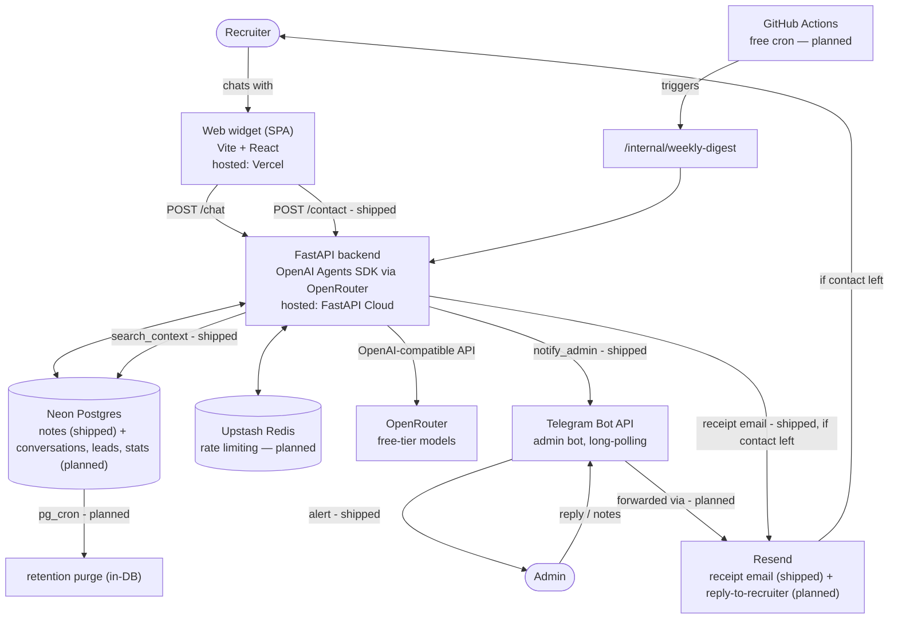

# Architecture & Tech Stack

Status: Draft v1 · companion to [[PRD.md]]

## 1. System overview




## 2. Component decisions


| Concern                                         | Choice                                                                                          | Why                                                                                                                                                                                                                                                                                                                                                |
| ----------------------------------------------- | ----------------------------------------------------------------------------------------------- | -------------------------------------------------------------------------------------------------------------------------------------------------------------------------------------------------------------------------------------------------------------------------------------------------------------------------------------------------- |
| Agent runtime                                   | OpenAI Agents SDK (Python)                                                                      | requested; native structured-output support via `output_type`, native tool-calling for `request_contact`/`search_context`                                                                                                                                                                                                                          |
| Model provider                                  | **OpenRouter**, free-tier (`:free`) models                                                      | Agents SDK talks to any OpenAI-compatible endpoint. Configured via standard `OPENAI_BASE_URL`/`OPENAI_API_KEY`/`OPENAI_RESPONSES_MODEL` env vars (defaulting to OpenRouter) so switching providers later is an env change, not a code change. Zero LLM cost today; tradeoff is free-model rate limits and occasional availability changes, see §11 |
| Backend                                         | FastAPI                                                                                         | requested; async, pairs naturally with Agents SDK, deploys to FastAPI Cloud                                                                                                                                                                                                                                                                        |
| Backend hosting                                 | **FastAPI Cloud**, free tier                                                                    | requested; purpose-built for FastAPI, avoids configuring a generic PaaS                                                                                                                                                                                                                                                                            |
| Frontend                                        | Vite + React SPA (not Next.js)                                                                  | it's a single chat page, not a multi-route site — a static SPA is less to configure/deploy than a framework with SSR you don't need                                                                                                                                                                                                                |
| Frontend hosting                                | **Vercel**, free/Hobby tier                                                                     | requested; trivial static deploy, free custom subdomain                                                                                                                                                                                                                                                                                            |
| Database                                        | **Neon Postgres**, free tier                                                                    | requested; shipped for context notes (§6); also gives an upgrade path to `pgvector` in the same DB if the notes table ever needs real vector search — no new service                                                                                                                                                                              |
| Cache / rate limit                              | **Upstash Redis**, free tier — *planned, not built (§9)*                                        | requested; serverless-friendly (HTTP-based), enough headroom for personal-scale traffic                                                                                                                                                                                                                                                            |
| Email                                           | **Resend**, free tier — *receipt email shipped, admin-reply-forwarding planned*                 | requested; receipt email confirms the recruiter's message was received; forwarding the admin's Telegram reply back to them is the remaining piece                                                                                                                                                                                                |
| Admin interface                                 | **Telegram Bot API**, raw `httpx` calls, long-polling (`getUpdates`) — shipped for notes (§6), commands planned (§14) | no separate library needed for ~2 endpoints; long-polling avoids requiring a public webhook URL for a single-admin bot, unlike the originally planned webhook mode                                                                                                                                                                 |
| Scheduled jobs (weekly digest, retention purge) | **Split**: retention purge via **`pg_cron`** in Neon; weekly digest via **GitHub Actions cron** hitting an internal endpoint — *planned, not built (§12)* | purge is pure SQL, no reason to leave the database for it; digest needs an outbound Telegram call, which `pg_cron` alone can't do                                                                                                                                                                                                 |
| Knowledge base                                  | Plain text (resume + curated bio doc + cached GitHub summary) injected into the agent's context, plus a small notes RAG layer on Neon (§6) | small enough to fit directly — see §6                                                                                                                                                                                                                                                                                              |
| Observability                                   | Structured logs + a `usage_stats` table in Postgres, queried by `/stats` and the weekly digest — *planned, not built (§8)* | avoids standing up a third-party LLM observability platform for what's currently a personal project; see §7 for the upgrade path                                                                                                                                                                                                  |


## 3. Structured output — as tools, not a monolithic `output_type`

Original plan was one `output_type` Pydantic model covering `{message, component, content}`. That
doesn't stream well: structured-output JSON arrives as raw token fragments, so you can't show the
`message` text live without a partial-JSON parser. Revised approach, needed now that streaming is a
requirement (§5):

- The agent's **reply text stays plain string output**, streamed token-by-token as it's generated —
that's the thing that needs to feel alive.
- Rich components (the card types below) are **tool calls**, not part of the output shape. The agent
calls e.g. `show_projects(items=[...])` when a reply warrants it; the SDK emits that as a discrete
streamed event once the call's arguments are complete. No partial-JSON problem, because a tool
call's arguments aren't shown incrementally to the user anyway — the whole card renders at once,
which is what you want for a list/card UI (nobody needs a card to "type in").
- At most one UI tool call per turn (steered via the system prompt). No tool call → plain `text`
reply, which is the common case.

Component set — these match the actual UI design (see §10), not a generic placeholder set:


| tool              | renders                         | content shape                                                                                                                                                                                                                                                                                    |
| ----------------- | ------------------------------- | ------------------------------------------------------------------------------------------------------------------------------------------------------------------------------------------------------------------------------------------------------------------------------------------------ |
| `show_skills`     | grouped skill tags              | `[{category, skills: [str]}]`                                                                                                                                                                                                                                                                    |
| `show_projects`   | recent public GitHub repo cards | `[{name, description, url, language, updated}]` — no-arg tool call; backend fetches the 5 most recently pushed public repos live from the GitHub API (`app/github.py`), 1hr in-memory cache, never the model. Description falls back to an LLM summary of the repo's README when GitHub has none |
| `show_experience` | role cards                      | `[{role, company, period, bullets: [str]}]`                                                                                                                                                                                                                                                      |
| `show_education`  | education cards                 | `[{degree, school, period}]`                                                                                                                                                                                                                                                                     |
| `show_contact`    | key/value rows                  | `[{label, value}]`                                                                                                                                                                                                                                                                               |
| `show_resume`     | resume view/download card       | `{name, format, updated, size, url}` — no-arg tool call; backend fills content from the real file (`app/knowledge.py:RESUME_INFO`), never the model, so the URL can't be hallucinated                                                                                                            |
| `show_info`       | pull-quote card                 | `{quote}`                                                                                                                                                                                                                                                                                        |
| `request_contact` | inline contact-capture form     | `{reason}` — on submit the frontend calls `POST /contact` directly (no separate `escalate` agent tool), which alerts the admin on Telegram and, if an email was given, sends a receipt via Resend. See PRD §3.3                                                                                |
| `search_context`  | *(none — not a UI tool)*        | `{query}` — cosine-searches admin-added notes (§6) and returns matches as text for the agent to answer with; can run alongside a UI tool in the same turn since it renders nothing itself                                                                                                      |


Each tool's Pydantic arg schema is the SDK-enforced contract; the frontend switches on which tool
fired to pick a renderer (`src/components/ComponentCard.tsx` — see the frontend implementation).

## 4. Session & memory model

**Status: Postgres persistence below is planned, not built.** `app/main.py:_sessions` is currently an
in-memory `dict[session_id, messages]` — fine for one local dev process, but it resets on every
restart/redeploy and isn't shared across instances, so it won't survive serverless hosting. The
`conversations`/`messages` tables (§8) are what closes that gap; until then, the window/identity
behavior below already works, the durable-storage/digest/retention parts don't.

Deliberately not a multi-thread chat product — one active conversation at a time, no thread list/
switcher UI. Simpler to build, and matches how a recruiter actually uses this (one sitting, a handful
of questions).

- **Identity**: client generates a `session_id` (`crypto.randomUUID()`) on first load, stored in
`localStorage`. Sent with every `/chat` call. No auth, no cookies needed.
- **Context window**: backend loads the **last 10-12 messages** for that `session_id` (currently the
in-memory dict; Postgres once §8 lands) and sends only that window to the model. This bounds prompt
size/cost regardless of how long a conversation runs.
- **Storage vs. context are different things**: once §8 lands, the *full* transcript will be written
to Postgres per-message (needed for the weekly digest and the 90-day-retention transcript store from
PRD §4) — the 10-12 window only bounds what's replayed *to the model*, not what's kept.
- **New chat**: a visible reset control rotates `session_id` (new UUID, old one abandoned) and clears
the visible message list client-side. The old conversation isn't deleted — it just ages out under
the normal retention job. No backend call needed to "start" a new chat; the next `/chat` request
with the new `session_id` lazily creates a new `conversations` row.


## 5. Streaming

Transport: **Server-Sent Events** over the existing `/chat` POST — not WebSockets. The traffic is
one-directional (server → client, once per user turn) and SSE rides over plain HTTP, which is simpler
to host on FastAPI Cloud/Vercel than maintaining a WS connection for a low-traffic personal app.

Event types on the stream:


| event       | payload             | client behavior                                        |
| ----------- | ------------------- | ------------------------------------------------------ |
| `token`     | `{ text }`          | append to the current assistant bubble                 |
| `component` | `{ tool, content }` | render the matching card once, after the text finishes |
| `done`      | `{}`                | stop the typing indicator, message finalized           |
| `error`     | `{ message }`       | show a graceful inline error, don't crash the thread   |


```mermaid
sequenceDiagram
    participant U as Recruiter (browser)
    participant B as FastAPI backend
    participant M as OpenRouter (LLM)

    U->>B: POST /chat {session_id, message}
    B->>B: load last 10-12 messages for session_id
    B->>M: run agent (streamed)
    loop as tokens arrive
        M-->>B: text delta
        B-->>U: SSE event: token
    end
    opt agent calls a UI tool
        M-->>B: tool call complete (e.g. show_projects)
        B-->>U: SSE event: component
    end
    B->>B: persist user + assistant messages (Postgres — planned, §8; in-memory dict today)
    B-->>U: SSE event: done
```


Client reads the stream with `fetch` + a `ReadableStream` reader (not `EventSource` — that can't send
a POST body), parsing `event:`/`data:` lines manually. This is a well-understood ~30-line pattern, not
worth pulling in an SSE client library for.

## 6. Knowledge base — static profile + a small notes RAG layer

The corpus is `content/profile.md` — resume text plus a curated "about / FAQ" doc — realistically a
few tens of KB. That fits comfortably in a single context window with room to spare. GitHub activity
is not part of this static corpus; it's fetched live on demand (§3, `show_projects`) so it can't
go stale.

**Configurability**: `content/profile.md`, `content/system_prompt.md`, and the resume PDF are the only
person-specific inputs — swap those three plus the `CANDIDATE_NAME`/`GITHUB_USERNAME` env vars
(§10) to point Relay at a different profile without touching app code.

**Context notes (admin Telegram bot)**: the profile is static, but things change faster than it gets
rewritten (new role, new project, availability). `app/telegram_bot.py` long-polls Telegram for
messages from a single admin `chat_id` (`TELEGRAM_ADMIN_CHAT_ID` — anyone else is ignored), rewrites
each one into a clean note via one LLM call, and holds it pending until the admin replies "save" (or
"cancel"). Saved notes go into `app/context_store.py`: a `notes(text, embedding)` table in Neon
Postgres (`DATABASE_URL`) — not SQLite, since FastAPI Cloud/Vercel are serverless and a local file
wouldn't persist (or be shared) across instances. `DATABASE_URL` unset -> notes are silently dropped
and `search_context` always returns nothing, rather than crashing (same graceful-disable pattern as
the Telegram bot with no token). The `search_context` tool lets the agent embed the recruiter's
question and cosine-match it against those notes before answering — a real RAG step, just without a
dedicated vector DB: brute-force cosine over a Python list is fine at the scale of a personal notes
table (dozens to low hundreds of rows).

**Upgrade path if the notes table grows** (thousands of rows, this stops being "brute-force fast
enough"): Neon already supports the `pgvector` extension, so swap `context_store.py`'s scan for its
`<=>` operator — same `add_note`/`search_notes` interface, just the query changes.

## 7. Observability — why no dedicated LLM ops platform (yet)

`/chat` and `/telegram/webhook` log token counts and estimated cost per request into a
`usage_stats` table. `/stats` and the weekly digest are just queries against that table. This covers
the ask (traffic, usage, weekly updates) without adding a service like Langfuse or Helicone.

**Upgrade path**: if you want request-level tracing/replay (not just aggregate stats), Langfuse has a
generous free cloud tier and drops in as a wrapper around the Agents SDK calls — add it later without
touching the data model above.

## 8. Data model (minimum viable)

**Status: not yet built.** Only `notes(id, text, embedding, created_at)` (§6) exists in Neon today.
Sessions currently live in an in-memory dict (`app/main.py:_sessions`) — fine for one dev process, but
it resets on every restart/redeploy and won't be shared across instances on serverless hosting, which
is exactly the problem that pushed `notes` onto Neon (§6). Planned tables, same database:

- `conversations(id, session_id, started_at, last_message_at)`
- `messages(id, conversation_id, role, content, component, created_at)` — purged after 90 days; the
10-12 message context window (§4) is just `ORDER BY created_at DESC LIMIT 12` against this table
- `escalations(id, conversation_id, reason, created_at)`
- `leads(id, escalation_id, email, created_at)` — **not** purged with the transcript retention job
- `usage_stats(date, requests, tokens_in, tokens_out, estimated_cost_usd, unique_sessions)`

## 9. Rate limiting

**Status: not yet built** — `/chat` currently has zero request throttling, which is a real risk before
this goes public (a looped client can burn through OpenRouter quota, or a real bill on a paid
embedding model). Planned: Redis-backed sliding window per session/IP on `/chat` (e.g., N
requests/minute, M/day) via Upstash. Even with a free chat model, this stays important — free-tier
models on OpenRouter carry their own request-rate caps shared across your whole app, so one abusive
client can lock out real recruiters if it's not capped per-session first.

## 10. Naming — finalized: Relay

Subdomain: pick a personal one, e.g. `relay.yourdomain.com`. Ties directly into the escalation
feature — the agent *relays* to the admin when it can't answer — and reads fine as both a product
name and a Telegram display name.

Telegram *usernames* are globally unique and the platform requires them to end in "bot" (unavoidable
platform rule), but that only affects the internal `@handle` (e.g. `@relayhq_bot`), not the
public-facing brand/display name, which is just "Relay". Check the exact `@handle` for availability
via @BotFather at registration time.

## 11. Cost

Everything above — including the LLM itself — runs on free tiers at personal/resume-bot traffic
levels:

- Model calls go through **OpenRouter's free (**`:free`**-suffixed) models** via an OpenAI-compatible
endpoint, so the Agents SDK setup barely changes — just a different `base_url` and API key.
- Tradeoff: free OpenRouter models carry real rate limits (roughly tens of requests/minute and a
daily cap shared across all free models, tighter still with $0 account balance) and the specific
models on offer can change over time. Fine for a personal-scale resume bot; not something to build
on for guaranteed uptime.
- **Upgrade path**: if a free model gets rate-limited or deprecated, swapping in a cheap *paid*
OpenRouter model (e.g. a small Llama or Gemini Flash variant, fractions of a cent/request) is a
one-line config change — same endpoint, same code, just a different model string and a small top-up.

If traffic ever outgrows a free tier elsewhere (Neon storage, Upstash command count, Vercel
bandwidth), each has a cheap next tier (~$5-20/mo) to step up individually rather than needing a
wholesale re-platform.

## 12. Scheduled jobs

**Status: not yet built.** Two different jobs, two different mechanisms, once §8's tables exist:

- **Retention purge** (`DELETE FROM messages WHERE created_at < now() - interval '90 days'`) is pure
SQL with no outbound call — a good fit for **`pg_cron`**, which Neon supports directly in the
database (no external scheduler, no internal HTTP endpoint to secure). Caveat: `pg_cron` only fires
while compute is active, so it won't run during Neon's free-tier scale-to-zero suspension — either
accept jobs occasionally getting skipped on a cold branch, or pin that branch always-on.
- **Weekly digest** needs an outbound call (send a Telegram message), which `pg_cron` alone can't do.
Stays on an external trigger — GitHub Actions cron hitting an internal `/internal/weekly-digest`
endpoint — unless a later Neon feature adds outbound HTTP from scheduled queries.

## 13. CI

**Shipped.** `.github/workflows/ci.yml` runs on every PR and push to `main`: backend job (`uv sync` +
`tests.test_smoke` + `tests.test_context_store`) and frontend job (`tsc --noEmit` + `npm run build`).
Both jobs are required status checks on the `main` branch protection rule, so a red PR literally
can't merge, not just "shouldn't."

## 14. Telegram bot commands

**Status: partially built.** `app/telegram_bot.py` currently handles free-text messages only (the
note-taking flow, §6). Planned slash commands, same long-polling loop, same admin-only `chat_id`
check:

- `/health` — backend + DB reachability, quick sanity check from your phone
- `/stats` — today's traffic, sessions, token/cost usage (needs `usage_stats`, §8)
- `/weekly` — on-demand version of the Monday digest (§12)