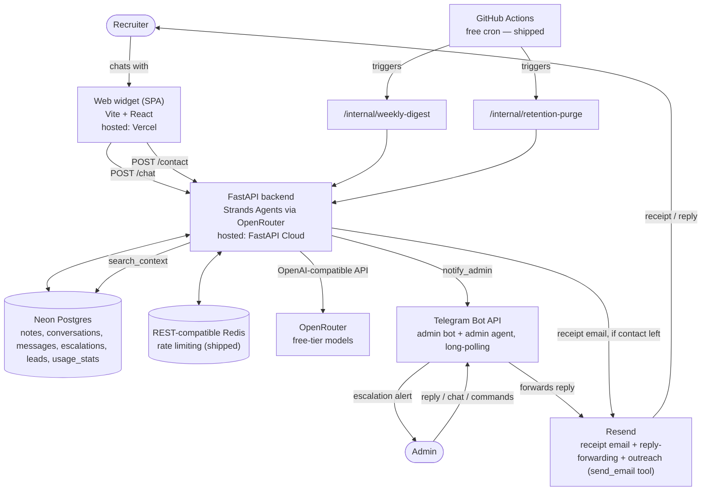
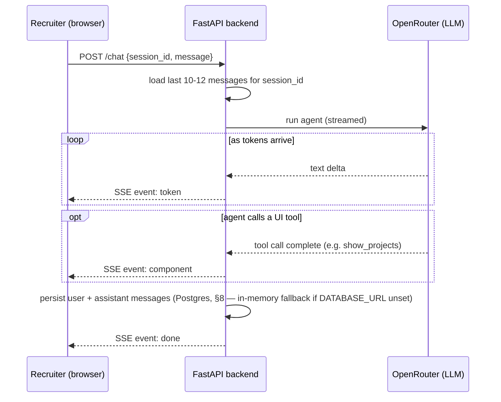

# Architecture & Tech Stack

Status: Draft v1 · companion to [[PRD.md]]

## 1. System overview

## 2. Component decisions

| Concern                                         | Choice                                                                                          | Why                                                                                                                                                                                                                                                                                                                                                |
| ----------------------------------------------- | ----------------------------------------------------------------------------------------------- | -------------------------------------------------------------------------------------------------------------------------------------------------------------------------------------------------------------------------------------------------------------------------------------------------------------------------------------------------- |
| Agent runtime                                   | **Strands Agents** (Python) — migrated from the OpenAI Agents SDK                               | native tool-calling for `request_contact`/`search_context`; model-agnostic runtime not tied to OpenAI's own agent framework                                                                                                                                                                                                                          |
| Model provider                                  | **OpenRouter**, free-tier (`:free`) models                                                      | Strands' OpenAI provider talks to any OpenAI-compatible endpoint. Configured via standard `OPENAI_BASE_URL`/`OPENAI_API_KEY`/`OPENAI_RESPONSES_MODEL` env vars (defaulting to OpenRouter) so switching providers later is an env change, not a code change. Zero LLM cost today; tradeoff is free-model rate limits and occasional availability changes, see §11 |
| Backend                                         | FastAPI                                                                                         | requested; async, pairs naturally with Strands' async agent runtime, deploys to FastAPI Cloud                                                                                                                                                                                                                                                                        |
| Backend hosting                                 | **FastAPI Cloud**, free tier                                                                    | requested; purpose-built for FastAPI, avoids configuring a generic PaaS                                                                                                                                                                                                                                                                            |
| Frontend                                        | Vite + React SPA (not Next.js)                                                                  | it's a single chat page, not a multi-route site — a static SPA is less to configure/deploy than a framework with SSR you don't need                                                                                                                                                                                                                |
| Frontend hosting                                | **Vercel**, free/Hobby tier                                                                     | requested; trivial static deploy, free custom subdomain                                                                                                                                                                                                                                                                                            |
| Database                                        | **Neon Postgres**, free tier                                                                    | requested; shipped for context notes, sessions, and escalations/leads (§6/§8); also gives an upgrade path to `pgvector` in the same DB if the notes table ever needs real vector search — no new service                                                                                                                                                                              |
| Cache / rate limit                              | Any REST-compatible Redis (Upstash is the reference implementation), free tier — *shipped (§9)* | requested; serverless-friendly (HTTP-based), enough headroom for personal-scale traffic                                                                                                                                                                                                                                                            |
| Email                                           | **Resend**, free tier — *shipped*: receipt, admin-reply-forwarding, and admin-agent outreach (`send_email`), all resume-attached, `Reply-To` configurable separately from the sending address | requested; receipt confirms the recruiter's message was received; reply-forwarding is the admin's actual personal response; outreach lets the admin agent send follow-ups directly                                                                                                                                                                                                |
| Admin interface                                 | **Telegram Bot API**, raw `httpx` calls, long-polling (`getUpdates`) — shipped: escalation alerts + admin agent (§6), commands planned (§14) | no separate library needed for ~2 endpoints; long-polling avoids requiring a public webhook URL for a single-admin bot, unlike the originally planned webhook mode                                                                                                                                                                 |
| Scheduled jobs (weekly digest, retention purge) | Both via **GitHub Actions cron** hitting internal endpoints — *shipped (§12)* | one scheduling mechanism for both jobs is simpler than two; `pg_cron` would've needed a privileged Neon role not every `DATABASE_URL` grants, and couldn't do the digest's outbound Telegram call anyway                                                                                                                          |
| Knowledge base                                  | Plain text (resume + curated bio doc + cached GitHub summary) injected into the agent's context, plus a small notes RAG layer on Neon (§6) | small enough to fit directly — see §6                                                                                                                                                                                                                                                                                              |
| Observability                                   | Structured logs + a `usage_stats` table in Postgres, queried by `/stats` and the weekly digest — *shipped (§7/§8)* | avoids standing up a third-party LLM observability platform for what's currently a personal project; see §7 for the upgrade path                                                                                                                                                                                                  |

## 3. Structured output — as tools, not a monolithic `output_type`

Original plan was one `output_type` Pydantic model covering `{message, component, content}`. That
doesn't stream well: structured-output JSON arrives as raw token fragments, so you can't show the
`message` text live without a partial-JSON parser. Revised approach, needed now that streaming is a
requirement (§5):

- The agent's **reply text stays plain string output**, streamed token-by-token as it's generated —
that's the thing that needs to feel alive.
- Rich components (the card types below) are **tool calls**, not part of the output shape. The agent
calls e.g. `show_projects(items=[...])` when a reply warrants it; the SDK emits that as a discrete
streamed event once the call's arguments are complete. No partial-JSON problem, because a tool
call's arguments aren't shown incrementally to the user anyway — the whole card renders at once,
which is what you want for a list/card UI (nobody needs a card to "type in").
- At most one UI tool call per turn (steered via the system prompt). No tool call → plain `text`
reply, which is the common case.

Component set — these match the actual UI design (see §10), not a generic placeholder set:

| tool              | renders                         | content shape                                                                                                                                                                                                                                                                                    |
| ----------------- | ------------------------------- | ------------------------------------------------------------------------------------------------------------------------------------------------------------------------------------------------------------------------------------------------------------------------------------------------ |
| `show_skills`     | grouped skill tags              | `[{category, skills: [str]}]`                                                                                                                                                                                                                                                                    |
| `show_projects`   | recent public GitHub repo cards | `[{name, description, url, language, updated}]` — no-arg tool call; backend fetches the 5 most recently pushed public repos live from the GitHub API (`app/github.py`), 1hr in-memory cache, never the model. Description falls back to an LLM summary of the repo's README when GitHub has none |
| `show_experience` | role cards                      | `[{role, company, period, bullets: [str]}]`                                                                                                                                                                                                                                                      |
| `show_education`  | education cards                 | `[{degree, school, period}]`                                                                                                                                                                                                                                                                     |
| `show_contact`    | key/value rows                  | `[{label, value}]`                                                                                                                                                                                                                                                                               |
| `show_resume`     | resume view/download card       | `{name, format, updated, size, url}` — no-arg tool call; backend fills content from the real file (`app/knowledge.py:RESUME_INFO`), never the model, so the URL can't be hallucinated                                                                                                            |
| `show_info`       | pull-quote card                 | `{quote}`                                                                                                                                                                                                                                                                                        |
| `request_contact` | inline contact-capture form     | `{reason}` — on submit the frontend calls `POST /contact` directly (no separate `escalate` agent tool), which alerts the admin on Telegram and, if an email was given, sends a receipt via Resend. See PRD §3.3                                                                                |
| `search_context`  | *(none — not a UI tool)*        | `{query}` — cosine-searches admin-added notes (§6) and returns matches as text for the agent to answer with; can run alongside a UI tool in the same turn since it renders nothing itself                                                                                                      |

Each tool's Pydantic arg schema is the SDK-enforced contract; the frontend switches on which tool
fired to pick a renderer (`src/components/ComponentCard.tsx` — see the frontend implementation).

## 4. Session & memory model

**Status: shipped.** Chat history is written to Neon Postgres per-message (`app/sessions.py`,
`conversations`/`messages` tables, §8) — full transcript, not just the replayed window. If
`DATABASE_URL` is unset, `app/sessions.py` falls back to an in-memory `dict[session_id, messages]`
(same graceful-disable pattern as `context_store.py`/`mailer.py`/`rate_limit.py`) so local dev keeps
working without Postgres — it just resets on restart and isn't shared across instances, same
limitation the old always-in-memory version had everywhere.

Deliberately not a multi-thread chat product — one active conversation at a time, no thread list/
switcher UI. Simpler to build, and matches how a recruiter actually uses this (one sitting, a handful
of questions).

- **Identity**: client generates a `session_id` (`crypto.randomUUID()`) on first load, stored in
`localStorage`. Sent with every `/chat` call. No auth, no cookies needed.
- **Context window**: backend loads the **full stored history** for that `session_id` and sends only
the **last 10-12 messages** (`HISTORY_WINDOW`) to the model. This bounds prompt size/cost regardless
of how long a conversation runs.
- **Storage vs. context are different things**: the full transcript is kept in Postgres (needed for
the weekly digest, still planned, and the 90-day-retention purge from PRD §4, shipped — see §12) —
the 10-12 window only bounds what's replayed *to the model*, not what's kept.
- **New chat**: a visible reset control rotates `session_id` (new UUID, old one abandoned) and clears
the visible message list client-side. The old conversation isn't deleted — it just ages out under
the retention purge job (§12). No backend call needed to "start" a new chat; the next `/chat`
request with the new `session_id` lazily creates a new `conversations` row.

## 5. Streaming

Transport: **Server-Sent Events** over the existing `/chat` POST — not WebSockets. The traffic is
one-directional (server → client, once per user turn) and SSE rides over plain HTTP, which is simpler
to host on FastAPI Cloud/Vercel than maintaining a WS connection for a low-traffic personal app.

Event types on the stream:

| event       | payload             | client behavior                                        |
| ----------- | ------------------- | ------------------------------------------------------ |
| `token`     | `{ text }`          | append to the current assistant bubble                 |
| `component` | `{ tool, content }` | render the matching card once, after the text finishes |
| `done`      | `{}`                | stop the typing indicator, message finalized           |
| `error`     | `{ message }`       | show a graceful inline error, don't crash the thread   |

Client reads the stream with `fetch` + a `ReadableStream` reader (not `EventSource` — that can't send
a POST body), parsing `event:`/`data:` lines manually. This is a well-understood ~30-line pattern, not
worth pulling in an SSE client library for.

## 6. Knowledge base — static profile + a small notes RAG layer

The corpus is `content/profile.md` — resume text plus a curated "about / FAQ" doc — realistically a
few tens of KB. That fits comfortably in a single context window with room to spare. GitHub activity
is not part of this static corpus; it's fetched live on demand (§3, `show_projects`) so it can't
go stale.

**Configurability**: `content/profile.md`, `content/system_prompt.md`, and the resume PDF are the only
person-specific inputs — swap those three plus the `CANDIDATE_NAME`/`GITHUB_USERNAME` env vars
(§10) to point Relay at a different profile without touching app code.

**Context notes (admin Telegram bot)**: the profile is static, but things change faster than it gets
rewritten (new role, new project, availability). `app/telegram_bot.py` long-polls Telegram for
messages from a single admin `chat_id` (`TELEGRAM_ADMIN_CHAT_ID` — anyone else is ignored). Anything
that isn't a reply to an escalation alert (§3.3/§9 below) goes to `app/admin_agent.py` — a second,
private Strands agent (own tool set, same underlying `MODEL`) the admin chats with directly,
with three tools:
- `save_note` — rewrites rough input into a clean note and saves it, same effect the old
  manual rewrite/confirm flow had, just conversational now
- `get_session_history` — pulls a recruiter's full transcript by `session_id` (included in every
  escalation alert, see §9) so the admin can ask the agent to summarize or recall context
- `send_email` — drafts and sends outreach/follow-up emails via `app/mailer.py`'s
  `send_custom_email` (resume attached automatically, same as every other outgoing email)

Saved notes go into `app/context_store.py`: a `notes(text, embedding)` table in Neon Postgres
(`DATABASE_URL`) — not SQLite, since FastAPI Cloud/Vercel are serverless and a local file wouldn't
persist (or be shared) across instances. `DATABASE_URL` unset -> notes are silently dropped and
`search_context` always returns nothing, rather than crashing (same graceful-disable pattern as the
Telegram bot with no token). The `search_context` tool lets the public-facing agent embed the
recruiter's question and cosine-match it against those notes before answering — a real RAG step,
just without a dedicated vector DB: brute-force cosine over a Python list is fine at the scale of a
personal notes table (dozens to low hundreds of rows).

The admin agent's own chat history rides the same `conversations`/`messages` tables as recruiter
sessions (§8), under a synthetic `admin:{chat_id}` `session_id` — originally an in-memory-per-process
dict that reset on every backend restart, which in practice meant re-explaining context to the admin
agent constantly. Subject to the same 90-day retention purge as recruiter transcripts (§12).

**Upgrade path if the notes table grows** (thousands of rows, this stops being "brute-force fast
enough"): Neon already supports the `pgvector` extension, so swap `context_store.py`'s scan for its
`<=>` operator — same `add_note`/`search_notes` interface, just the query changes.

## 7. Observability — why no dedicated LLM ops platform (yet)

**Status: shipped.** Both agents (`app/agent.py:stream_reply`, `app/admin_agent.py:run_admin_agent`)
log token counts and estimated cost per run into a `usage_stats` table (`app/usage_stats.py`), one
row per day, upserted. `/stats` and `/weekly` (Telegram commands, §14) are just queries against that
table plus a live `COUNT(DISTINCT)` over `conversations`/`messages` for unique sessions. This covers
the ask (traffic, usage, weekly updates) without adding a service like Langfuse or Helicone.

**Upgrade path**: if you want request-level tracing/replay (not just aggregate stats), Langfuse has a
generous free cloud tier and drops in as a wrapper around the Strands agent calls — add it later without
touching the data model above.

## 8. Data model (minimum viable)

**Status: shipped.** All tables
live in the same Neon database, one shared connection pool (`app/db.py`). Schema is applied via
`CREATE TABLE IF NOT EXISTS` on first connect — but that's a no-op against a table that already
exists, even one that predates a newer column, so adding a column to an existing table also needs
an explicit `ALTER TABLE ... ADD COLUMN IF NOT EXISTS` alongside it (see `leads.name`/
`leads.telegram_message_id` in `app/db.py` for the pattern). No separate migration tool for a
schema this size.

Shipped (`app/sessions.py`):
- `conversations(id, session_id, started_at, last_message_at)`
- `messages(id, conversation_id, role, content, created_at)` — full transcript, written per-message.
  Purged after 90 days by the retention purge job (§12).
- `escalations(id, conversation_id, reason, created_at)` — one row per `/contact` submission,
  with or without an email, so dead-end escalations can be told apart from ones that became usable
  leads (PRD §7 success metric)
- `leads(id, escalation_id, email, name, telegram_message_id, created_at)` — only inserted when an
  email was given; will **not** be purged with the transcript retention job once that exists (PRD
  §4). `telegram_message_id` is the admin alert's Telegram message ID, so a reply to that message
  can be matched back to this lead's email (`get_lead_by_message_id`, used by
  `app/telegram_bot.py:poll`).

- `usage_stats(date, requests, tokens_in, tokens_out, estimated_cost_usd)` (`app/usage_stats.py`) —
  one row per day, upserted after every agent run. `unique_sessions` isn't a stored column here:
  ponytail — a live `COUNT(DISTINCT)` against `conversations`/`messages` at query time is cheap
  enough at personal-scale traffic and can't drift out of sync with the real data, so `/stats`/
  `/weekly` compute it on demand instead of maintaining a second aggregate.

Also still using the pre-Neon-model `notes(id, text, embedding, created_at)` table (§6) — unrelated
to sessions, kept as-is.

## 9. Rate limiting

**Status: shipped** — `POST /chat` and `POST /contact` are capped per client IP (20/min, 200/day,
fixed window) via `app/rate_limit.py`, over any REST-compatible Redis (`REDIS_REST_URL`/
`REDIS_REST_TOKEN` — Upstash's REST API is the reference implementation, no vendor-specific env
names). IP rather than session, since `session_id` is client-controlled and trivially resettable
(`localStorage`). Fails open (allows the request) on Redis errors or when the env vars are unset —
a rate limiter shouldn't itself be a single point of failure, but that also means it's inert until
configured. Even with a free chat model this matters — free-tier models on OpenRouter carry their
own request-rate caps shared across the whole app, so one abusive client can lock out real
recruiters if it's not capped per-IP first.

## 10. Naming — finalized: Relay

Subdomain: pick a personal one, e.g. `relay.yourdomain.com`. Ties directly into the escalation
feature — the agent *relays* to the admin when it can't answer — and reads fine as both a product
name and a Telegram display name.

Telegram *usernames* are globally unique and the platform requires them to end in "bot" (unavoidable
platform rule), but that only affects the internal `@handle` (e.g. `@relayhq_bot`), not the
public-facing brand/display name, which is just "Relay". Check the exact `@handle` for availability
via @BotFather at registration time.

## 11. Cost

Everything above — including the LLM itself — runs on free tiers at personal/resume-bot traffic
levels:

- Model calls go through **OpenRouter's free (**`:free`**-suffixed) models** via an OpenAI-compatible
endpoint, so the Strands model config barely changes — just a different `base_url` and API key.
- Tradeoff: free OpenRouter models carry real rate limits (roughly tens of requests/minute and a
daily cap shared across all free models, tighter still with $0 account balance) and the specific
models on offer can change over time. Fine for a personal-scale resume bot; not something to build
on for guaranteed uptime.
- **Upgrade path**: if a free model gets rate-limited or deprecated, swapping in a cheap *paid*
OpenRouter model (e.g. a small Llama or Gemini Flash variant, fractions of a cent/request) is a
one-line config change — same endpoint, same code, just a different model string and a small top-up.

If traffic ever outgrows a free tier elsewhere (Neon storage, Upstash command count, Vercel
bandwidth), each has a cheap next tier (~$5-20/mo) to step up individually rather than needing a
wholesale re-platform.

## 12. Scheduled jobs

**Status: shipped.**

Both scheduled jobs use the same mechanism — **GitHub Actions cron** hitting an internal FastAPI
endpoint, guarded by a shared secret in an `X-Internal-Key` header (`INTERNAL_API_KEY`). Each
endpoint 404s (not 401s) when that env var is unset, so it's invisible rather than just
unauthorized, same as every other optional feature's graceful-disable pattern.

- **Retention purge** (`DELETE FROM messages WHERE created_at < now() - interval '90 days'`) was
originally planned as a `pg_cron` job (pure SQL, no outbound call needed) — Neon supports it
directly in the database. In practice `CREATE EXTENSION pg_cron`/`cron.schedule` need a privileged
role that the default `DATABASE_URL` role doesn't grant, so it's a GitHub Actions cron
(`.github/workflows/retention-purge.yml`, daily 03:00 UTC) hitting `POST /internal/retention-purge`
instead — `app/sessions.py:purge_old_messages`. escalations/leads are untouched (PRD §4 — only the
raw transcript is time-limited).
- **Weekly digest** needs an outbound call (send a Telegram message), which `pg_cron` couldn't do
anyway. GitHub Actions cron (`.github/workflows/weekly-digest.yml`, Monday 14:00 UTC) hits
`POST /internal/weekly-digest`. Shares its digest-building logic
(`app/telegram_bot.py:build_weekly_digest`) with the on-demand `/weekly` Telegram command (§14).

## 13. CI/CD

**Shipped.** `.github/workflows/ci.yml` runs on every PR and push to `main`: backend job (`uv sync` +
`tests.test_smoke` + `tests.test_context_store`) and frontend job (`tsc --noEmit` + `npm run build`).
Both jobs are required status checks on the `main` branch protection rule, so a red PR literally
can't merge, not just "shouldn't."

Deploys are automatic on push to `main`, one mechanism per side: `.github/workflows/deploy.yml`
runs `uv run fastapi deploy` against the backend (auth via the `FASTAPI_CLOUD_TOKEN`/
`FASTAPI_CLOUD_APP_ID` repo secrets, provisioned by `fastapi cloud ci setup`); the frontend
deploys via Vercel's native GitHub integration (connected directly in the Vercel dashboard, no
workflow file needed on that side).

## 14. Telegram bot commands

**Status: shipped.** `app/telegram_bot.py` dispatches on exact-match text against a `COMMANDS` dict
before falling through to the free-text note-taking/admin-agent flow (§6), same long-polling loop,
same admin-only `chat_id` check:

- `/health` — backend + DB reachability (`SELECT 1`), quick sanity check from your phone
- `/stats` — today's requests, tokens in/out, estimated cost, and unique sessions (`app/usage_stats.py`)
- `/weekly` — last 7 days of the same stats, plus conversation/escalation/lead counts and an
  LLM-generated "top topics" summary over the week's recruiter questions
  (`app/agent.py:summarize_weekly_topics`). Shared with the Monday auto-push (§12).
