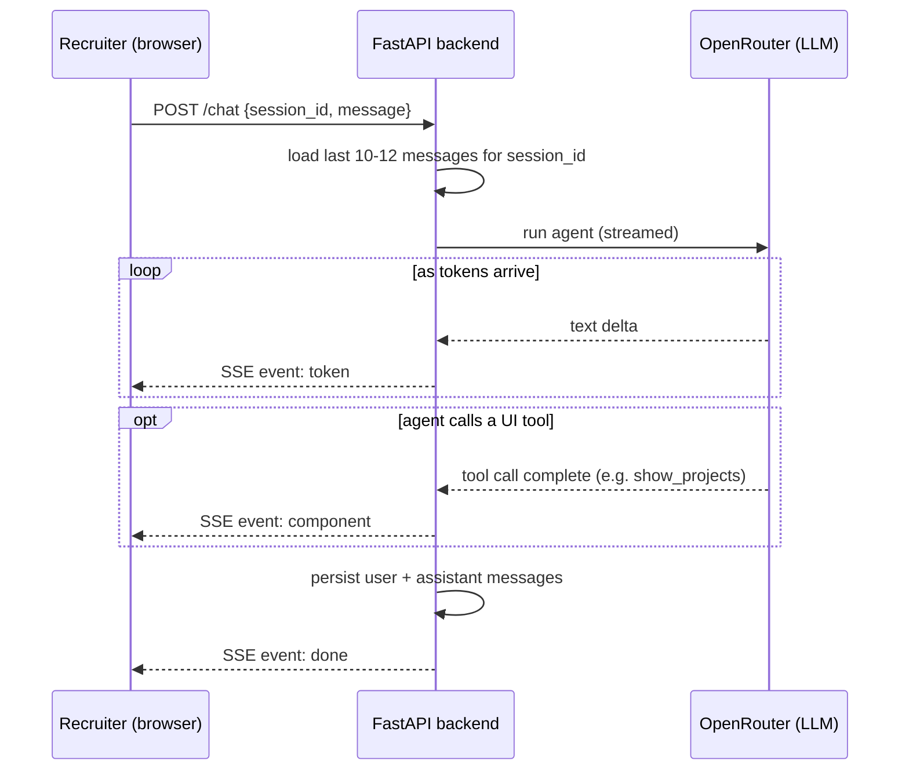

# Architecture & Tech Stack

Status: Draft v1 · companion to [[PRD.md]]

## 1. System overview

```mermaid
flowchart TD
    Recruiter([Recruiter]) -->|chats with| Widget["Web widget (SPA)<br/>Vite + React<br/>hosted: Vercel"]
    Widget -->|POST /chat| Backend["FastAPI backend<br/>OpenAI Agents SDK via OpenRouter<br/>hosted: FastAPI Cloud"]

    Backend <--> DB[("Neon Postgres<br/>conversations, leads, stats")]
    Backend <--> Redis[("Upstash Redis<br/>rate limiting")]
    Backend -->|OpenAI-compatible API| OpenRouter["OpenRouter<br/>free-tier models"]

    Backend -->|escalate()| TG["Telegram Bot API<br/>admin bot, webhook"]
    TG -->|alert| Chitresh([Chitresh])
    Chitresh -->|reply| TG
    TG -->|forwarded via| Resend["Resend<br/>email to recruiter"]
    Resend -->|if contact left| Recruiter

    Cron["GitHub Actions<br/>free cron"] -->|triggers| Digest["/internal/weekly-digest"]
    Cron -->|triggers| Purge["/internal/purge-old-conversations"]
    Digest --> Backend
    Purge --> Backend
```

## 2. Component decisions

| Concern | Choice | Why |
|---|---|---|
| Agent runtime | OpenAI Agents SDK (Python) | requested; native structured-output support via `output_type`, native tool-calling for `escalate()` |
| Model provider | **OpenRouter**, free-tier (`:free`) models | Agents SDK talks to any OpenAI-compatible endpoint. Configured via standard `OPENAI_BASE_URL`/`OPENAI_API_KEY`/`OPENAI_RESPONSES_MODEL` env vars (defaulting to OpenRouter) so switching providers later is an env change, not a code change. Zero LLM cost today; tradeoff is free-model rate limits and occasional availability changes, see §11 |
| Backend | FastAPI | requested; async, pairs naturally with Agents SDK, deploys to FastAPI Cloud |
| Backend hosting | **FastAPI Cloud**, free tier | requested; purpose-built for FastAPI, avoids configuring a generic PaaS |
| Frontend | Vite + React SPA (not Next.js) | it's a single chat page, not a multi-route site — a static SPA is less to configure/deploy than a framework with SSR you don't need |
| Frontend hosting | **Vercel**, free/Hobby tier | requested; trivial static deploy, free custom subdomain |
| Database | **Neon Postgres**, free tier | requested; also gives an upgrade path to `pgvector` in the same DB if RAG is ever needed — no new service |
| Cache / rate limit | **Upstash Redis**, free tier | requested; serverless-friendly (HTTP-based), enough headroom for personal-scale traffic |
| Email | **Resend**, free tier | requested; used only for escalation reply-to-recruiter emails, not bulk mail |
| Admin interface | **Telegram Bot API** (python-telegram-bot, webhook mode) | requested; doubles as the entire admin surface — no separate dashboard to build |
| Scheduled jobs (weekly digest, retention purge) | **GitHub Actions cron** hitting internal endpoints | free, zero extra infra; avoids running an in-process scheduler that only works if the backend stays warm |
| Knowledge base | Plain text (resume + curated bio doc + cached GitHub summary) injected into the agent's context | small enough to fit directly — see §4 |
| Observability | Structured logs + a `usage_stats` table in Postgres, queried by `/stats` and the weekly digest | avoids standing up a third-party LLM observability platform for what's currently a personal project; see §7 for the upgrade path |

## 3. Structured output — as tools, not a monolithic `output_type`

Original plan was one `output_type` Pydantic model covering `{message, component, content}`. That
doesn't stream well: structured-output JSON arrives as raw token fragments, so you can't show the
`message` text live without a partial-JSON parser. Revised approach, needed now that streaming is a
requirement (§5):

- The agent's **reply text stays plain string output**, streamed token-by-token as it's generated —
  that's the thing that needs to feel alive.
- Rich components (the card types below) are **tool calls**, not part of the output shape. The agent
  calls e.g. `show_projects(items=[...])` when a reply warrants it; the SDK emits that as a discrete
  streamed event once the call's arguments are complete. No partial-JSON problem, because a tool
  call's arguments aren't shown incrementally to the user anyway — the whole card renders at once,
  which is what you want for a list/card UI (nobody needs a card to "type in").
- At most one UI tool call per turn (steered via the system prompt). No tool call → plain `text`
  reply, which is the common case.

Component set — these match the actual UI design (see §10), not a generic placeholder set:

| tool | renders | content shape |
|---|---|---|
| `show_skills` | grouped skill tags | `[{category, skills: [str]}]` |
| `show_projects` | project cards | `[{title, year, description, tech: [str]}]` |
| `show_experience` | role cards | `[{role, company, period, bullets: [str]}]` |
| `show_education` | education cards | `[{degree, school, period}]` |
| `show_contact` | key/value rows | `[{label, value}]` |
| `show_resume` | resume download card | `{name, format, updated, size, url}` |
| `show_info` | pull-quote card | `{quote}` |
| `request_contact` | inline contact-capture form | `{reason}` — ties into the `escalate()` flow in PRD §3.3 |

Each tool's Pydantic arg schema is the SDK-enforced contract; the frontend switches on which tool
fired to pick a renderer (`src/components/ComponentCard.tsx` — see the frontend implementation).

## 4. Session & memory model

Deliberately not a multi-thread chat product — one active conversation at a time, no thread list/
switcher UI. Simpler to build, and matches how a recruiter actually uses this (one sitting, a handful
of questions).

- **Identity**: client generates a `session_id` (`crypto.randomUUID()`) on first load, stored in
  `localStorage`. Sent with every `/chat` call. No auth, no cookies needed.
- **Context window**: backend loads the **last 10-12 messages** for that `session_id` from Postgres
  and sends only that window to the model. This bounds prompt size/cost regardless of how long a
  conversation runs.
- **Storage vs. context are different things**: the *full* transcript is still written to Postgres
  per-message (needed for the weekly digest and the 90-day-retention transcript store from PRD §4) —
  the 10-12 window only bounds what's replayed *to the model*, not what's kept.
- **New chat**: a visible reset control rotates `session_id` (new UUID, old one abandoned) and clears
  the visible message list client-side. The old conversation isn't deleted — it just ages out under
  the normal retention job. No backend call needed to "start" a new chat; the next `/chat` request
  with the new `session_id` lazily creates a new `conversations` row.

## 5. Streaming

Transport: **Server-Sent Events** over the existing `/chat` POST — not WebSockets. The traffic is
one-directional (server → client, once per user turn) and SSE rides over plain HTTP, which is simpler
to host on FastAPI Cloud/Vercel than maintaining a WS connection for a low-traffic personal app.

Event types on the stream:

| event | payload | client behavior |
|---|---|---|
| `token` | `{ text }` | append to the current assistant bubble |
| `component` | `{ tool, content }` | render the matching card (§3) once, after the text finishes |
| `done` | `{}` | stop the typing indicator, message finalized |
| `error` | `{ message }` | show a graceful inline error, don't crash the thread |



Client reads the stream with `fetch` + a `ReadableStream` reader (not `EventSource` — that can't send
a POST body), parsing `event:`/`data:` lines manually. This is a well-understood ~30-line pattern, not
worth pulling in an SSE client library for.

## 6. Knowledge base — why no vector DB (yet)

The corpus is: resume text, a curated "about / FAQ" doc, and a cached summary of public GitHub repos —
realistically a few tens of KB. That fits comfortably in a single context window with room to spare.
Adding embeddings + a vector store now would mean standing up and maintaining retrieval infra for a
problem you don't have.

**Upgrade path if the KB grows** (many long docs, blog posts, case studies): Neon already supports the
`pgvector` extension, so RAG can be added by embedding docs into the same Postgres instance — no new
service, just a new table and a retrieval step before the agent call.

## 7. Observability — why no dedicated LLM ops platform (yet)

`/chat` and `/telegram/webhook` log token counts and estimated cost per request into a
`usage_stats` table. `/stats` and the weekly digest are just queries against that table. This covers
the ask (traffic, usage, weekly updates) without adding a service like Langfuse or Helicone.

**Upgrade path**: if you want request-level tracing/replay (not just aggregate stats), Langfuse has a
generous free cloud tier and drops in as a wrapper around the Agents SDK calls — add it later without
touching the data model above.

## 8. Data model (minimum viable)

- `conversations(id, session_id, started_at, last_message_at)`
- `messages(id, conversation_id, role, content, component, created_at)` — purged after 90 days; the
  10-12 message context window (§4) is just `ORDER BY created_at DESC LIMIT 12` against this table
- `escalations(id, conversation_id, reason, created_at)`
- `leads(id, escalation_id, email, created_at)` — **not** purged with the transcript retention job
- `usage_stats(date, requests, tokens_in, tokens_out, estimated_cost_usd, unique_sessions)`

## 9. Rate limiting

Redis-backed sliding window per session/IP on `/chat` (e.g., N requests/minute, M/day). Even with a
free model, this stays important — free-tier models on OpenRouter carry their own request-rate caps
shared across your whole app, so one abusive client can lock out real recruiters if it's not capped
per-session first.

## 10. Naming — finalized: Relay

Subdomain: **relay.chitreshgyanani.com**. Ties directly into the escalation feature — the agent
*relays* to Chitresh when it can't answer — and reads fine as both a product name and a Telegram
display name.

Telegram *usernames* are globally unique and the platform requires them to end in "bot" (unavoidable
platform rule), but that only affects the internal `@handle` (e.g. `@relayhq_bot`), not the
public-facing brand/display name, which is just "Relay". Check the exact `@handle` for availability
via @BotFather at registration time.

## 11. Cost

Everything above — including the LLM itself — runs on free tiers at personal/resume-bot traffic
levels:

- Model calls go through **OpenRouter's free (`:free`-suffixed) models** via an OpenAI-compatible
  endpoint, so the Agents SDK setup barely changes — just a different `base_url` and API key.
- Tradeoff: free OpenRouter models carry real rate limits (roughly tens of requests/minute and a
  daily cap shared across all free models, tighter still with $0 account balance) and the specific
  models on offer can change over time. Fine for a personal-scale resume bot; not something to build
  on for guaranteed uptime.
- **Upgrade path**: if a free model gets rate-limited or deprecated, swapping in a cheap *paid*
  OpenRouter model (e.g. a small Llama or Gemini Flash variant, fractions of a cent/request) is a
  one-line config change — same endpoint, same code, just a different model string and a small top-up.

If traffic ever outgrows a free tier elsewhere (Neon storage, Upstash command count, Vercel
bandwidth), each has a cheap next tier (~$5-20/mo) to step up individually rather than needing a
wholesale re-platform.
